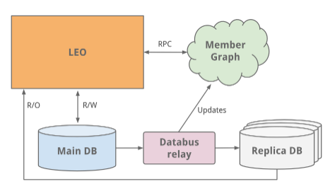
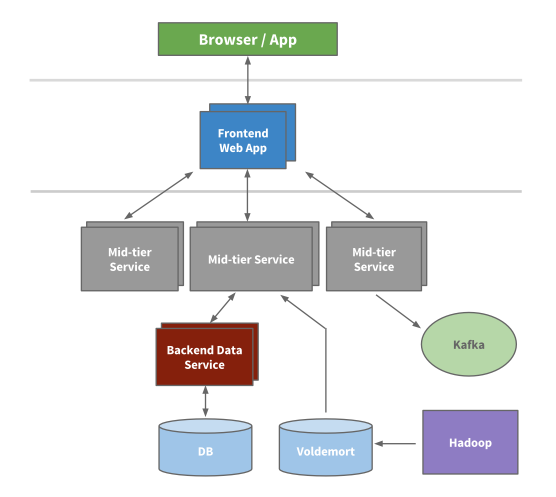
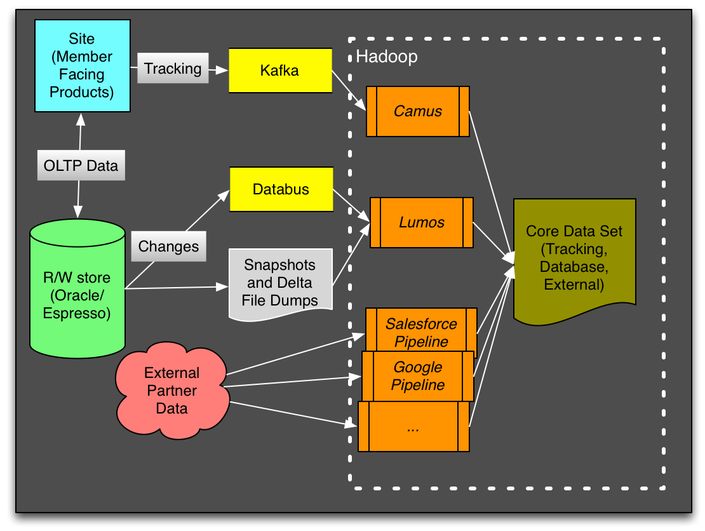
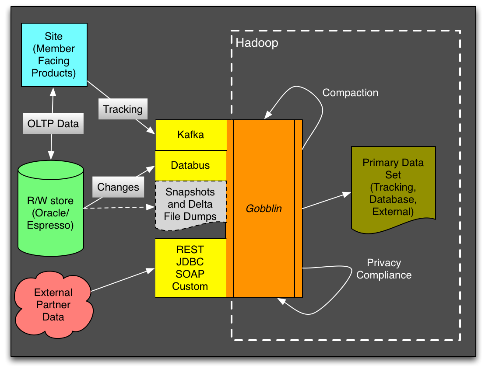

# Trabalho prático: Analisando Arquiteturas de Sistemas de Software Populares - LinkedIn 

# O que é o LinkedIn
  O LinkedIn é uma plataforma de rede social voltada para o mercado profissional. Ela permite que os usuários construam e ampliem suas redes profissionais, façam publicações de conteúdo, divulguem oportunidades de carreira e estabeleçam conexões significativas no mundo dos negócios.  
  A ferramenta foi lançada oficialmente em 5 de maio de 2003, buscando conectar profissionais do mundo todo, tornando-os mais produtivos e bem-sucedidos. Em sua primeira semana conseguiu alcançar a marca de 2700 usuários.  
  Atualmente é uma plataforma popular para recrutamento, networking e desenvolvimento profissional com mais de 850 milhões de usuários em 200 países e territórios.  

# Dificuldades/Requisitos
* Implementar uma maneira de gerenciar conexões entre usuários
* Escalar para milhões de usuários
* Alta disponibilidade

# Histórico de mudanças no projeto

## Início do projeto
### Monolito
* Leo:  
  O LinkedIn começou como um único aplicativo monolito chamado "Leo". Ele hospedava web servlets para cada uma das várias páginas, continha a lógica de negócios e se conectava aos diversos bancos de dados do LinkedIn.  

* Grafos de usuários:  
  Um dos pontos cruciais de uma rede social é gerenciar as conexões dos usuários. Era necessário um sistema capaz de realizar queries nos dados de conexões dos usuários em memória, visando eficiência e performance. Devido a esses requisitos, foi necessário a separação desse módulo do sistema para um outro independente, realizando comunicação utilizando Java RPC, facilitando assim a escalabididade individual dessa parte.
  O grafo de usuários criado passou então a alimentar um serviço de busca utilizando a biblioteca Apache Lucene.
* Replica read DBs:  
Com o tempo, o site se popularizou de maneira veloz, com isso a o banco de dados de perfis de usuários começou a ficar sobrecarregado. 
Inicialmente foi realizado um escalonamento vertical, ou seja foram adicionadas novas e mais potentes CPUs e maior quantidade de memória RAM. Essa solução foi efetiva no primeiro momento até que uma solução permanete fosse desenvolvida. 
A solução desenvolvida foi gerar replicas do banco de dados para apenas leitura. Os bancos utilizados até então eram todos para leitura e escrita o que sobrecarregava os mesmos, e a partir dessa mudança passaram a existir replicas apenas para leitura, aliviando a carga sobre o banco de dados principal uma vez que muitas dessas requisições passaram a ser enviadas diretamente para a replica utilizando um Load balancer.
Para manter as réplicas de leitura sincronizadas foi criada o [databus](https://github.com/linkedin/databus), que nos dias de hoje possui código aberto.

  

### Service Oriented Architecture (SOA)
O site continuou a crescer e chegou a um ponto onde manter o monolito se tornou inviável. O aplicativo de produção seguia caindo frequentemente e investigar o problema, realizar manutenções, desenvolver novas funcionalidades e recuperar o servidor era sempre uma operação muito complexa. 
Com isso as seguintes estratégias foram adotadas:

* O que é SOA:  
  A Service-Oriented Architecture (SOA) é um estilo arquitetural baseado na criação e uso de componentes independentes e interoperáveis chamados serviços para desenvolver um software. Nesse modelo, os componentes interagem entre si para realizar as funcionalidades mais complexas do sistema.  Essa abordagem permite a reutilização de serviços, facilita a integração entre sistemas e promove a modularidade e a escalabilidade.  
  Com a adoção do SOA, os números de serviços disponíveis na base de código do Linkedin apenas cresceu, alcançando 150 serviços em 2010 e ultrapassando 750 em 2015
  
* Caching:  
  Buscando escalar ainda mais foram adicionadas novas camadas de caching utilizando das tecnologias memcache e couchbase nos módulos da aplicação além de utilizar da tecnologia [Voldemort](https://www.project-voldemort.com/voldemort/), desenvolvida pelo Linkedin para cachear camadas de dados e precomputar resultados quando possível, se tratando de um banco de chave-valor, similar a alternativas atuais como o [Apache Cassandra](https://cassandra.apache.org/). 
  Vale ressaltar que nessa etapa foram adicionadas caches em excesso e futuramente alguns desses foram retirados.
* Kafka:  
  Para coletar a grande quantidade de dados, que crescia cada vez mais, foram desenvolvidas diversas pipelines de dados. A fim de contribuir com a escalabilidade de cada uma dessas foi criado o [Kafka](https://kafka.apache.org/), que tinha como papel servir como um centralizador dessas pipelines permitindo o acesso aos dados em near realtime.

## Inversion
No fim de 2011 o LinkedIn tomou uma iniciatia interna chamada de Inversion, que consistia em pausar o desenvolvimento de novas features e focar na melhoria do sistema, infraestrutura e deploy. A partir do sucesso dessa, os desenvolvedor envolvidos no projeto conseguiram desenvolver as soluções eficientes e escaláveis que são utilizadas atualmente.

## Espresso

Em um ritmo em que o número de requisições à infraestrutura de armazenamento do Linkedin dobrava a cada ano foi encontrado um problema quanto ao crescimento de custos, latência e capacidade de entrega da plataforma. Isso se dava pois a estrutura atual do backend das features relacionadas a perfil de usuários, composta por um backend que utilizava do memcached como cache de leitura entre a aplicação e o banco de dados se tornava cada vez mais insustentavel devido à problemas de performance e baixa manutenabilidade.

Com isso em 2014 é introduzido o [Espresso](https://engineering.linkedin.com/blog/2023/upscaling-profile-datastore-while-reducing-costs), um banco de dados NoSQL online, distribuido e tolerante a falhas, e com outras caracteristicas relacionadas a latência e escalabilidade foi possível abandonar a solução anterior utilizando memcached. Para isso são necessários roteadores, que agem como um proxy para requisições e adotam um [cache off-heap](https://github.com/snazy/ohc) e nós de armazenamento.

Eventualmente foi necessário adicionar novamente uma camada de cache ao backend de perfil, e considerando que mais de 99% das requisições recebidas eram de leitura, foi adotada uma estratégia diferente. 

Dessa vez foi adotado o Couchbase na camada de armazenamento, assim poupando desenvolvedores de terem que lidar com lógica de cache em suas aplicações. Apesar de atuar na camada de armazenamento, o Couchbase existe de forma separada à fonte de verdade do Espresso, funcionando de forma em que os roteadores tem acesso as réplicas do Couchbase operando entre os roteadores e a fonte de dados.

## Arquitetura Atual

### Rest.li
Com a adoção do SOA um problema foi se tornando cada vez mais aparente, no caso a adoção do Java RPC por parte do Leo, monolito que cada vez mais se tornava defasado, e que acabava encontrando problemas com a comunicação com outros serviços. Para resolver esse problema é criado o Rest.li, que buscava centralizar a comunicação centralizada em modelos, comunicando-se formatado como um JSON via HTTP. Um beneficio percebido com a adoção do Rest.li foi o desacoplamento do frontend com o backend. 

### Super Blocks
O conceito de Super Blocks foi concebido pelo Linkedin para lidar com um dos problemas encontrados com o crescimento da arquitetura de serviços, sendo no caso o aumento do número de chamadas geradas pelo que inicialmente aparenta ser apenas uma chamada. Isso é o caso por exemplo na busca de dados de um usuário, que contem mídias, conexões dentre outros dados. 
Então é introduzida a ideia de permitir que serviços sejam agrupados em uma única API, permitindo um time ter maior controle sobre seus serviços.

### Multi-Data Center
Com o crescimento da plataforma ao decorrer dos anos, não era mais possível confiar em manter todos os dados em apenas um único datacenter. Com isso os dados foram sendo adicionados a novos datacenters espalhados ao redor do globo, e eventualmente permitindo associar usuários à datacenters mais próximos à eles geograficamente. 

Para lidar com a replicação dos dados em diversos datacenters foi desenvolvido o datastore Espresso, que é uma tecnologia NoSQL criada com o propósito de atender esse requisito. 

A adoção da utilização de múltiplos datacenters também auxiliou a manter a plataforma sempre com alta disponibilidade, aumentando também a tolerância à falhas.

### Processamento de dados/ Analytics

Todos os dias, a plataforma do LinkedIn gera uma grande quantidade de dados e esses são armazenados em bancos de dados e sistemas de registro de eventos. Ao longo dos anos, foram desenvolvidas muitas soluções para o consumo de dados dos bancos de dados de origem (Oracle, MySQL, Espresso) como o uso de arquivos incrementais periodicamente ou stream de captura de alterações em dados (Databus). 
Além disso, rastrear todos os eventos importantes e transmiti-los por meio do pipeline central citado anteriormente (Kafka). Devido a grande quantidade de dados gerados diariamente, foi necessário uma solução que possa escalar com pouco esforço e disponibilizar dados com baixa latência.
  
Para isso os dados de analytics eram todos armazenados em um repositório central de dados utilizando do Hadoop HDFS. Esses dados vinham de diversas fontes o que tornava o controle desse pipeline complexo, por isso foi adotado o framework Goblin para centralizar e realizar essa ingestão para o HDFS. 
Antes:

Depois:

## Autores

O trabalho acima foi desenvolvido como parte da disciplica Arquitetura de Software, lecionada no 5o periodo da graduação em Engenharia de Software pela Pontifícia Universidade Católica de Minas Gerais.

Bernardo Aquino Capello Coelho
Guilherme Roberto Ferreira Santos
Gustavo de Castro Nogueira
Thalles Nascimento Carvalho

# Referências:

* https://engineering.linkedin.com/architecture/brief-history-scaling-linkedin
* https://about.linkedin.com/pt-br
* https://aws.amazon.com/pt/what-is/service-oriented-architecture/#:~:text=you%20implement%20microservices%3F-,What%20is%20service%2Doriented%20architecture%3F,other%20across%20platforms%20and%20languages.
* Slides da disciplina de Arquitetura de Software
* https://engineering.linkedin.com/data-ingestion/gobblin-big-data-ease
* https://engineering.linkedin.com/espresso/introducing-espresso-linkedins-hot-new-distributed-document-store
* https://engineering.linkedin.com/blog/2023/upscaling-profile-datastore-while-reducing-costs
