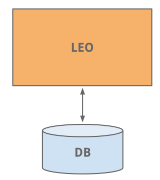

# Trabalho prático: Analisando Arquiteturas de Sistemas de Software Populares - LinkedIn

# O que é o LinkedIn
  O LinkedIn é uma plataforma de rede social voltada para o mercado profissional. Ela permite que os usuários construam e ampliem suas redes profissionais, façam publicações de conteúdo, divulguem oportunidades de carreira e estabeleçam conexões significativas no mundo dos negócios.  
  É uma plataforma popular para recrutamento, networking e desenvolvimento profissional com mais de 850 milhões de usuários em 200 países e territórios.  
  A ferrmenta foi lançado oficialmente em 5 de maio de 2003, buscando conectar profissionais do mundo todo, tornando-os mais produtivos e bem-sucedidos.  

# Dificuldades/Requisitos
* 850 milhões de usuarios
* Alta disponibilidade

# Histórico de mudanças no projeto

## Início do projeto
### Monolito
* Leo
  O LinkedIn começou como um único aplicativo monolito chamado "Leo". Ele hospedava web servlets para cada uma das várias páginas, continha a lógica de negócios e se conectava aos diversos bancos de dados do LinkedIn.  

  
* Member Graph
* Replica read DBs
Com o tempo, o site se popularizou de maneira veloz, com isso a o banco de dados de perfis de usuários começou a ficar sobrecarregado. 
Inicialmente foi realizado um escalonamento vertical, ou seja foi adicionado novas e mais potentes CPUs e memórias RAM. Essa solução foi efetiva no primeiro momento até que uma solução permanete fosse desenvolvida. 
A solução desenvolvida foi gerar replicas do banco de dados para apenas leitura. Os bancos utilizados era todos para leitura e escrita o que sobrecarregava os mesmos, e passaram a existir replicas apenas para leitura, aliviando o banco de dados principal uma vez que muitas dessas requisições passaram a ser enviadas diretamente para a replica utilizando de um Load balancer.

### Service Oriented Architecture (SOA)
O site continuou a crescer e chegou a um ponto onde manter o monolito se tornou inviável. O aplicativo de produção seguia caindo frequentemente e investigar o problema, realizar manutenções, desenvolver novos códigos e recuperar o servidor era sempre uma operação muito complexa. 
Com isso as seguintes soluções foram adotadas:

* O que é SOA:  
  A Service-Oriented Architecture (SOA) é um estilo arquitetural baseado na criação e uso de componentes independentes e interoperáveis chamados serviços para desenvolver um software. Nesse modelo, os componentes interagem entre si para realizar as funcionalidades mais complexas do sistema.  Essa abordagem permite a reutilização de serviços, facilita a integração entre sistemas e promove a modularidade e a escalabilidade.
* Caching:  
* Kafka:  
* Inversion:  

## Arquitetura Atual

### Rest.li
### Super Blocks
### Multi-Data Center

### Processamento de dados

# Referências:

* https://engineering.linkedin.com/architecture/brief-history-scaling-linkedin
* https://about.linkedin.com/pt-br
* https://aws.amazon.com/pt/what-is/service-oriented-architecture/#:~:text=you%20implement%20microservices%3F-,What%20is%20service%2Doriented%20architecture%3F,other%20across%20platforms%20and%20languages.
* Slides da disciplina de Arquitetura de Software
* https://engineering.linkedin.com/data-ingestion/gobblin-big-data-ease
